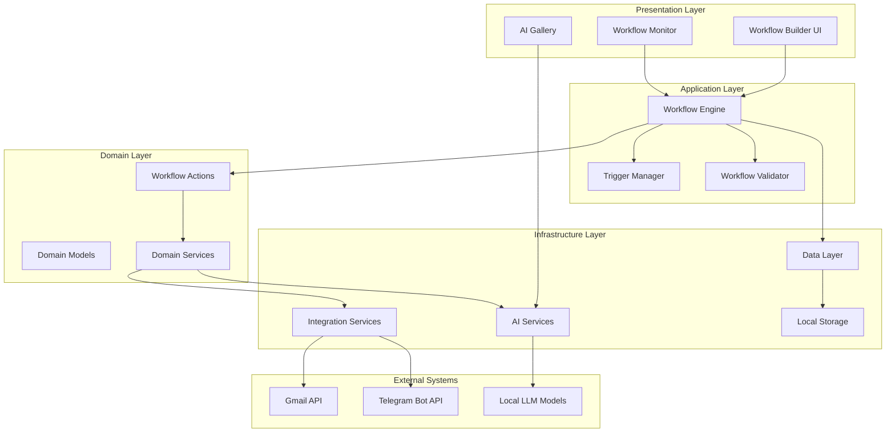
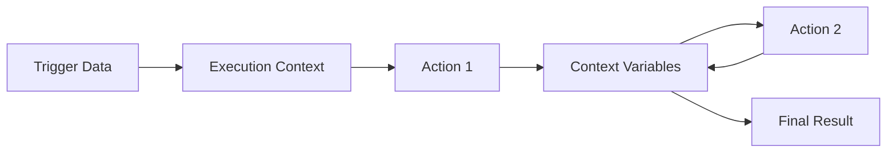

# LocalLLM Workflow System - Architecture Overview

**Last Updated**: August 17, 2025  
**Version**: 1.0.0  
**Architect**: LocalLLM Development Team

## 📋 Executive Summary

The LocalLLM Workflow System is a comprehensive automation platform built on Android that enables users to create intelligent workflows combining email processing, AI analysis, and multi-platform communication. The system emphasizes local AI processing, user privacy, and extensible architecture.

## 🏗️ High-Level Architecture



## 📊 System Components

### 1. Presentation Layer

#### Workflow Builder UI (`DynamicWorkflowBuilderActivity`)
- **Purpose**: Visual workflow creation and configuration
- **Key Features**:
  - Drag-and-drop workflow building
  - Real-time validation feedback
  - Multi-step wizard interface
  - Action configuration dialogs

#### Workflow Monitor (`WorkflowMonitorActivity`)
- **Purpose**: Real-time workflow execution monitoring
- **Key Features**:
  - Execution status tracking
  - Performance metrics
  - Error reporting
  - Historical analysis

#### AI Gallery (`AIGalleryActivity`)
- **Purpose**: AI processing showcase and testing
- **Key Features**:
  - Model testing interface
  - Processing history
  - Performance benchmarks

### 2. Application Layer

#### Workflow Engine (`MultiUserWorkflowEngine`)
- **Purpose**: Core workflow orchestration and execution
- **Responsibilities**:
  - Workflow lifecycle management
  - Action execution coordination
  - Context management
  - Error handling and recovery

```kotlin
class MultiUserWorkflowEngine(
    private val context: Context,
    private val userManager: UserManager,
    private val workflowRepository: WorkflowRepository,
    val executionRepository: WorkflowExecutionRepository,
    private val aiProcessor: AIWorkflowProcessor
) {
    suspend fun executeWorkflow(
        workflowId: String,
        triggerUserId: String,
        triggerData: Any
    ): Result<WorkflowExecutionResult>
}
```

#### Trigger Manager (`WorkflowTriggerManager`)
- **Purpose**: Automated workflow triggering
- **Responsibilities**:
  - Email monitoring
  - Telegram message monitoring
  - Geofence monitoring
  - Scheduled execution
  - Rate limiting and deduplication

#### Workflow Validator (`WorkflowValidator`)
- **Purpose**: Workflow configuration validation
- **Responsibilities**:
  - Syntax validation
  - Dependency checking
  - Permission verification
  - Variable scope analysis

### 3. Domain Layer

#### Workflow Actions (`MultiUserAction`)
- **Purpose**: Encapsulated workflow operations
- **Design Pattern**: Command Pattern
- **Key Actions**:
  - Communication actions (Gmail, Telegram)
  - AI processing actions
  - Control flow actions
  - Custom actions

```kotlin
sealed class MultiUserAction {
    data class SendToUserGmail(...) : MultiUserAction()
    data class AIAutoEmailSummarizer(...) : MultiUserAction()
    data class AISmartSummarizeAndForward(...) : MultiUserAction()
    // ... other actions
}
```

#### Domain Models (`Workflow.kt`)
- **Purpose**: Core business entities
- **Key Models**:
  - `MultiUserWorkflow`
  - `WorkflowExecutionContext`
  - `WorkflowExecutionResult`
  - `KeywordForwardingRule`

#### Domain Services
- **Purpose**: Business logic encapsulation
- **Services**:
  - `AIWorkflowProcessor`
  - `WorkflowImportExportManager`
  - `WorkflowTestHelper`

### 4. Infrastructure Layer

#### AI Services (`service/ai/`)
- **Purpose**: Local AI processing capabilities
- **Key Services**:
  - `SummarizationService`: Text summarization
  - `WorkflowKeywordService`: Keyword extraction
  - `SmartForwardingService`: Intelligent routing
  - `FaceDetectionService`: Image processing
  - `TextClassificationService`: Content classification

#### Integration Services (`service/integration/`)
- **Purpose**: External platform integration
- **Services**:
  - `GmailIntegrationService`: Gmail API integration
  - `TelegramBotService`: Telegram Bot API
  - `PlacesService`: Google Places integration

#### Data Layer (`data/`)
- **Purpose**: Data persistence and management
- **Components**:
  - `WorkflowRepository`: Workflow CRUD operations
  - `WorkflowExecutionRepository`: Execution history
  - `WorkflowDatabase`: Room database implementation
  - `UserManager`: User and authentication management

## 🎯 Design Patterns

### 1. SOLID Principles Implementation

#### Single Responsibility Principle (SRP)
- Each service has a single, well-defined purpose
- Separation of concerns between UI, business logic, and data

#### Open/Closed Principle (OCP)
- New workflow actions can be added without modifying existing code
- Plugin architecture for AI services

#### Liskov Substitution Principle (LSP)
- All workflow actions implement the same interface
- Interchangeable AI service implementations

#### Interface Segregation Principle (ISP)
- Small, focused interfaces for different aspects
- Separate interfaces for different service types

#### Dependency Inversion Principle (DIP)
- Dependency injection through `AppContainer`
- Abstraction-based service dependencies

### 2. Command Pattern
```kotlin
// Each workflow action is a command
interface Command {
    suspend fun execute(context: WorkflowExecutionContext): Result<String>
}

// Actions implement command pattern
data class SendEmailCommand(...) : MultiUserAction(), Command {
    override suspend fun execute(context: WorkflowExecutionContext): Result<String> {
        // Implementation
    }
}
```

### 3. Strategy Pattern
```kotlin
// Different summarization strategies
interface SummarizationStrategy {
    suspend fun summarize(text: String): Result<String>
}

class ConciseSummarizationStrategy : SummarizationStrategy
class DetailedSummarizationStrategy : SummarizationStrategy
class StructuredSummarizationStrategy : SummarizationStrategy
```

### 4. Repository Pattern
```kotlin
interface WorkflowRepository {
    suspend fun saveWorkflow(workflow: Workflow): Result<Unit>
    suspend fun getWorkflowById(id: String): Result<Workflow?>
    // ... other methods
}

class RoomWorkflowRepository : WorkflowRepository {
    // Room database implementation
}
```

### 5. Observer Pattern
```kotlin
// Workflow execution monitoring
interface WorkflowExecutionObserver {
    fun onWorkflowStarted(workflowId: String)
    fun onActionExecuted(actionResult: ActionResult)
    fun onWorkflowCompleted(executionResult: WorkflowExecutionResult)
}
```

## 🔧 Technical Architecture

### Dependency Injection

```kotlin
object AppContainer {
    fun provideWorkflowEngine(context: Context): MultiUserWorkflowEngine {
        return MultiUserWorkflowEngine(
            context = context,
            userManager = provideUserManager(context),
            workflowRepository = provideWorkflowRepository(context),
            executionRepository = provideExecutionRepository(context),
            aiProcessor = provideAIProcessor(context)
        )
    }
    
    // ... other providers
}
```

### Error Handling Strategy

```kotlin
// Consistent error handling using Result type
sealed class Result<out T> {
    data class Success<T>(val data: T) : Result<T>()
    data class Failure(val exception: Exception) : Result<Nothing>()
}

// Usage throughout the system
suspend fun executeWorkflow(...): Result<WorkflowExecutionResult> {
    return try {
        // Implementation
        Result.Success(executionResult)
    } catch (e: Exception) {
        Log.e(TAG, "Workflow execution failed", e)
        Result.Failure(e)
    }
}
```

### Concurrency Model

```kotlin
// Structured concurrency with coroutines
class WorkflowTriggerManager {
    private val scope = CoroutineScope(Dispatchers.IO + SupervisorJob())
    
    fun start() {
        scope.launch {
            while (isActive) {
                checkTriggers()
                delay(TRIGGER_CHECK_INTERVAL)
            }
        }
    }
    
    fun stop() {
        scope.cancel()
    }
}
```

## 🔄 Data Flow

### Workflow Execution Flow

1. **Trigger Detection**
   ```kotlin
   WorkflowTriggerManager.checkTriggers()
   → GmailIntegrationService.checkForNewEmails()
   → EmailDeduplicationService.filterNewEmails()
   ```

2. **Workflow Execution**
   ```kotlin
   MultiUserWorkflowEngine.executeWorkflow()
   → WorkflowValidator.validateWorkflow()
   → MultiUserWorkflowEngine.executeWorkflowActions()
   ```

3. **Action Execution**
   ```kotlin
   MultiUserWorkflowEngine.executeAction()
   → AIAutoEmailSummarizer.execute()
   → LocalLLMSummarizationService.summarizeEmail()
   → GmailIntegrationService.sendEmail()
   ```

4. **Result Storage**
   ```kotlin
   WorkflowExecutionRepository.saveExecution()
   → RoomDatabase.insert()
   ```

### Variable Flow



## 🔒 Security Architecture

### Data Protection

1. **Local Processing**: All AI operations happen locally
2. **Encrypted Storage**: Sensitive data encrypted at rest
3. **Secure Communication**: HTTPS for external API calls
4. **Access Control**: Permission-based workflow access

### Authentication

```kotlin
class UserManager {
    suspend fun authenticateUser(credentials: UserCredentials): Result<User>
    suspend fun hasPermission(userId: String, permission: Permission): Boolean
    fun getCurrentUser(): User?
}
```

### Input Validation

```kotlin
class InputValidator {
    fun validateEmail(email: String): ValidationResult
    fun validateWorkflowConfiguration(workflow: Workflow): ValidationResult
    fun sanitizeInput(input: String): String
}
```

## 📱 Mobile Architecture Considerations

### Android Components

- **Activities**: UI components using Jetpack Compose
- **Services**: Background workflow execution
- **Workers**: Scheduled and background tasks
- **Receivers**: System event handling

### Resource Management

```kotlin
class ModelManager {
    private var currentModel: LLMModel? = null
    
    suspend fun loadModel(modelPath: String): Result<Unit> {
        currentModel?.close() // Clean up previous model
        currentModel = LLMModel.load(modelPath)
        return Result.success(Unit)
    }
    
    fun cleanup() {
        currentModel?.close()
        currentModel = null
    }
}
```

### Performance Optimization

1. **Lazy Loading**: Models loaded on demand
2. **Background Processing**: Heavy operations in background threads
3. **Caching**: Intelligent caching of AI results
4. **Memory Management**: Proper cleanup of resources

## 🔧 Extensibility

### Plugin Architecture

```kotlin
interface WorkflowPlugin {
    fun getActions(): List<ActionDefinition>
    fun getTriggers(): List<TriggerDefinition>
    fun getAIServices(): List<AIServiceDefinition>
}

class PluginManager {
    fun registerPlugin(plugin: WorkflowPlugin)
    fun loadPlugins()
    fun getAvailableActions(): List<ActionDefinition>
}
```

### Custom Action Development

```kotlin
// 1. Define action
data class CustomAction(
    val parameter: String,
    val outputVariable: String = "custom_output"
) : MultiUserAction()

// 2. Implement execution
private suspend fun executeCustomAction(
    action: MultiUserAction.CustomAction,
    context: WorkflowExecutionContext
): Result<String> {
    // Custom implementation
}

// 3. Register with engine
workflowEngine.registerActionHandler(CustomAction::class) { action, context ->
    executeCustomAction(action as CustomAction, context)
}
```

## 📊 Monitoring and Observability

### Logging Strategy

```kotlin
class WorkflowLogger {
    companion object {
        private const val TAG = "WorkflowSystem"
        
        fun logWorkflowStart(workflowId: String) {
            Log.i(TAG, "Starting workflow: $workflowId")
        }
        
        fun logActionExecution(actionType: String, duration: Long) {
            Log.d(TAG, "Action $actionType completed in ${duration}ms")
        }
        
        fun logError(message: String, throwable: Throwable) {
            Log.e(TAG, message, throwable)
        }
    }
}
```

### Metrics Collection

```kotlin
class WorkflowMetrics {
    fun recordExecutionTime(workflowId: String, duration: Long)
    fun recordActionSuccess(actionType: String)
    fun recordActionFailure(actionType: String, error: String)
    fun getMetricsSummary(): MetricsSummary
}
```

## 🚀 Scalability Considerations

### Horizontal Scaling

- **Modular Architecture**: Independent service scaling
- **Stateless Design**: Stateless workflow execution
- **Event-Driven**: Asynchronous processing capabilities

### Performance Optimization

- **Batch Processing**: Multiple workflows in parallel
- **Caching Strategy**: Smart caching of AI results
- **Resource Pooling**: Shared resources across workflows

### Future Enhancements

1. **Cloud Integration**: Optional cloud AI services
2. **Distributed Execution**: Multi-device workflow execution
3. **Real-time Collaboration**: Shared workflow editing
4. **Advanced Analytics**: ML-based workflow optimization

## 📋 Quality Attributes

### Reliability

- **Fault Tolerance**: Graceful error handling
- **Recovery**: Automatic retry mechanisms
- **Data Integrity**: Consistent state management

### Maintainability

- **Clean Architecture**: Clear separation of concerns
- **Documentation**: Comprehensive code documentation
- **Testing**: Extensive unit and integration tests

### Performance

- **Responsiveness**: Sub-second UI interactions
- **Throughput**: Multiple concurrent workflows
- **Resource Efficiency**: Optimal memory and CPU usage

### Security

- **Privacy**: Local data processing
- **Authentication**: Secure user authentication
- **Authorization**: Role-based access control

---

**This architecture document serves as the foundation for understanding and extending the LocalLLM Workflow System. For implementation details, refer to the API Reference and Development Guidelines.**